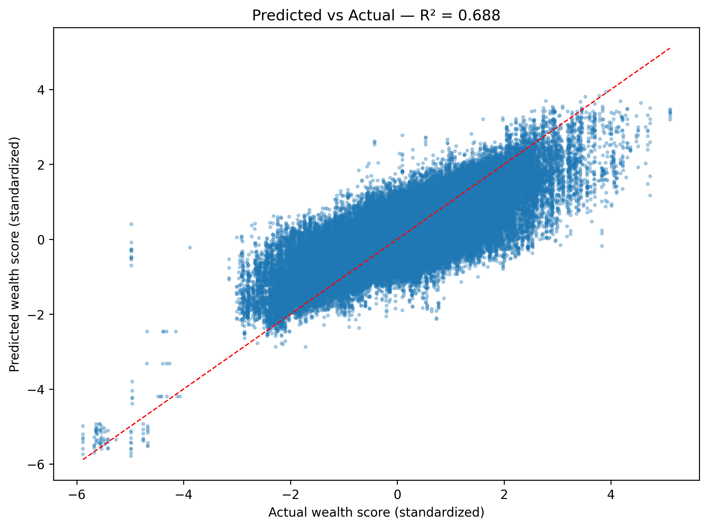
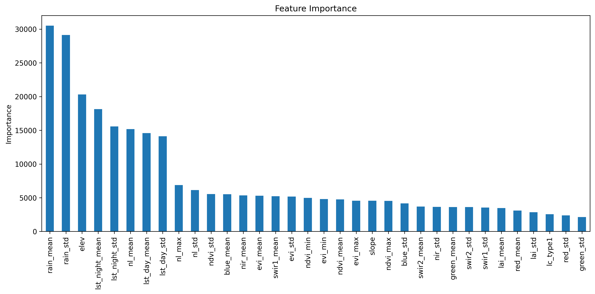

# 🌍 Global Wealth Estimation from Satellite Imagery

Predicting relative wealth across the developing world using satellite-derived features and DHS survey data — no ground truth required at prediction time.


---

## Overview

This project builds a machine learning pipeline that estimates relative wealth at 25km resolution across the developing world, using only freely available satellite imagery as input. The model is trained on ~1.2 million DHS (Demographic and Health Survey) cluster observations across **42 countries and 17 survey years (2003–2024)**, achieving an **R² of 0.69** on held-out data.

The key motivation: official wealth and poverty statistics are often unavailable, outdated, or too coarse to be actionable at the local level in many developing countries. Satellite imagery is global, consistent, and updated continuously — making it a powerful proxy for ground-level conditions.

> Predictions are shown within the CHIRPS rainfall data coverage zone (50°S–50°N), which aligns with the geographic distribution of the DHS training data. High-income regions above 50°N are excluded as they fall outside both the training distribution and the intended use case of the model.

---

## Results

| Metric | Value |
|--------|-------|
| R² Score | 0.69 |
| MAE | 0.41 (standardized units) |
| Training samples | ~935,000 DHS clusters |
| Countries | 42 |
| Survey years | 2003–2024 |
| Features | 34 satellite-derived |
| Model | LightGBM |

### Model Fit (Predicted vs Actual)



### Top Predictive Features

| Feature | Description |
|---------|-------------|
| `rain_mean` | Mean annual rainfall (CHIRPS) |
| `rain_std` | Rainfall variability |
| `elev` | Elevation (SRTM) |
| `lst_night_mean` | Nighttime land surface temperature |
| `lst_night_std` | LST variability |
| `nl_mean` | Nighttime lights (VIIRS/DMSP) |
| `lst_day_mean` | Daytime land surface temperature |

Rainfall and elevation dominate — reflecting the strong role of agricultural potential and geographic accessibility in driving wealth in developing regions.



---

## Pipeline

```
DHS Survey Data          Google Earth Engine         Python / LightGBM
─────────────────        ───────────────────         ─────────────────
HR/IR .dta files    →    Per-year composites    →    Feature matrix
GPS shapefiles           (MODIS, VIIRS,              Standardization
                         CHIRPS, SRTM)               Model training
                         ↓                           Prediction
                         33k DHS points              Global map
                         + 25km global grid
```

### Step 1 — DHS Data Preparation (`povertyest2.ipynb`, cells 1–4)
- Downloaded HR (Household Recode) and GPS files for 42 countries from [DHS Program](https://dhsprogram.com)
- Extracted cluster-level wealth scores (`hv271`) and quintiles (`hv270`) from HR files, with IR fallback
- Merged with GPS cluster coordinates
- Exported as `dhs_points.csv` for upload to Google Earth Engine

### Step 2 — Satellite Feature Extraction (Google Earth Engine)
- Uploaded `dhs_points.csv` as a GEE table asset
- Built per-survey-year composites (±1 year window around each survey) for 17 unique years
- Extracted 34 features per DHS cluster using `reduceRegions()` at 500m scale, 2km buffer
- Exported one CSV per survey year to Google Drive
- Also sampled a global 25km prediction grid across 8 world regions

**Collections used:**
| Collection | Features |
|-----------|---------|
| MODIS MOD09A1 | Surface reflectance (6 bands × mean + std) |
| MODIS MOD13A2 | NDVI, EVI (mean, min, max, std) |
| MODIS MOD11A2 | Land surface temperature day/night (mean + std) |
| MODIS MCD15A3H | Leaf Area Index (mean + std) |
| MODIS MCD12Q1 | Land cover type |
| CHIRPS Daily | Rainfall (mean + std) |
| USGS SRTM | Elevation, slope |
| VIIRS / DMSP | Nighttime lights (mean, max, std) |

> Nightlights use VIIRS for surveys from 2012 onwards and DMSP-OLS for earlier rounds (2003–2011), with automatic switching based on survey year.

### Step 3 — Model Training (`povertyest2.ipynb`, cells 5–22)
- Merged all year CSVs (~1.2M rows)
- **Within-country-year z-score standardization** of wealth scores — critical for pooling surveys across countries where raw scores are not comparable
- Imputed sparse bands (nightlights, rainfall, LAI) with 0 for arid/dark areas
- 80/20 random train/test split
- Trained LightGBM with early stopping

### Step 4 — Global Prediction & Mapping (`povertyest2.ipynb`, cells 23–30)
- Loaded 25km global grid CSVs (8 regions)
- Applied same imputation as training
- Predicted wealth for ~193,000 land pixels
- Visualized with plasma colormap on dark background

---

## Repository Structure

```
├── povertyest2.ipynb              # Main notebook — full pipeline
├── gee/
│   ├── 01_dhs_feature_extraction.js   # Per-point DHS feature extraction
│   └── 02_global_grid_export.js       # 25km global grid export
├── global_predicted_wealth_25km.png   # Output map
└── README.md
```

---

## Requirements

```bash
pip install pandas geopandas pyreadstat lightgbm scikit-learn matplotlib geodatasets
```

| Package | Purpose |
|---------|---------|
| `geopandas` | Reading DHS GPS shapefiles |
| `pyreadstat` | Reading DHS `.dta` / `.sav` files |
| `lightgbm` | Gradient boosting model |
| `scikit-learn` | Train/test split, metrics |
| `geodatasets` | World basemap for visualization |

---

## Data Access

**DHS Data** — requires free registration at [dhsprogram.com](https://dhsprogram.com). Download HR (Household Recode) and GPS files for your countries of interest.

**Satellite Data** — all collections are publicly available through [Google Earth Engine](https://earthengine.google.com). A free GEE account is required to run the extraction scripts.

**No data files are included in this repository** due to DHS data access restrictions.

---

## Limitations

- Wealth scores are **relative within each country** — the model predicts standardized scores, not absolute income levels
- Predictions are most reliable within the geographic range of DHS training data (Sub-Saharan Africa, South/Southeast Asia, Latin America)
- Desert and hyper-arid areas may have sparse predictions due to null satellite retrievals over bright surfaces
- The global grid uses a 2022 composite — predictions represent landscape conditions circa 2022, not real-time estimates

---

## References

- Jean et al. (2016). Combining satellite imagery and machine learning to predict poverty. *Science*, 353(6301), 790–794.
- Demographic and Health Surveys Program. [dhsprogram.com](https://dhsprogram.com)
- Funk et al. (2015). The climate hazards infrared precipitation with stations — a new environmental record for monitoring extremes. *Scientific Data*, 2, 150066.
